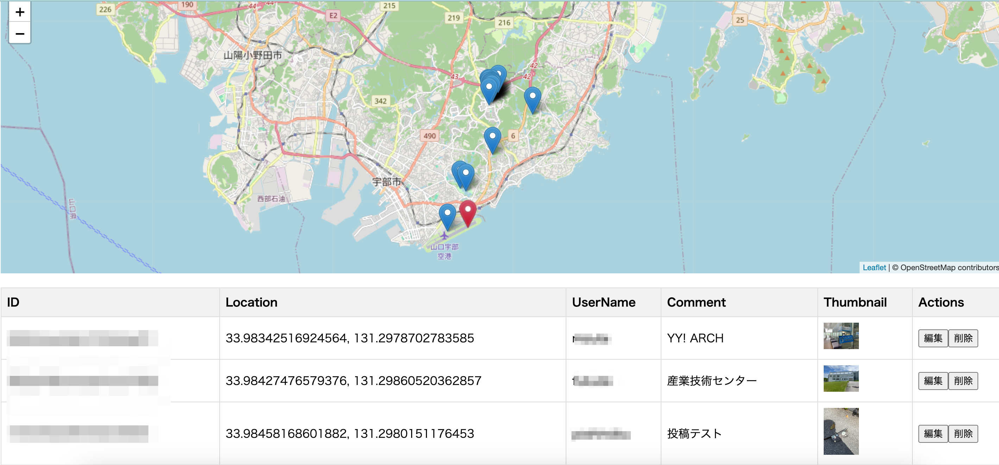

## 実際のファイル構造

このリポジトリにはmainしか含めていないが、
```
.
├── firebase.json
├── firestore.indexes.json
├── firestore.rules
├── public
│   ├── 404.html
│   ├── README.md
│   ├── config.js
│   ├── index.html
│   ├── script.js
│   └── style.css
└── storage.rules
```

上記のpublicフォルダを firebaseSDKでデプロイする。

## 実際のUI

